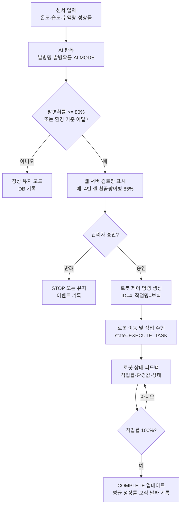
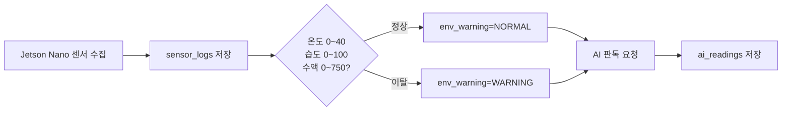
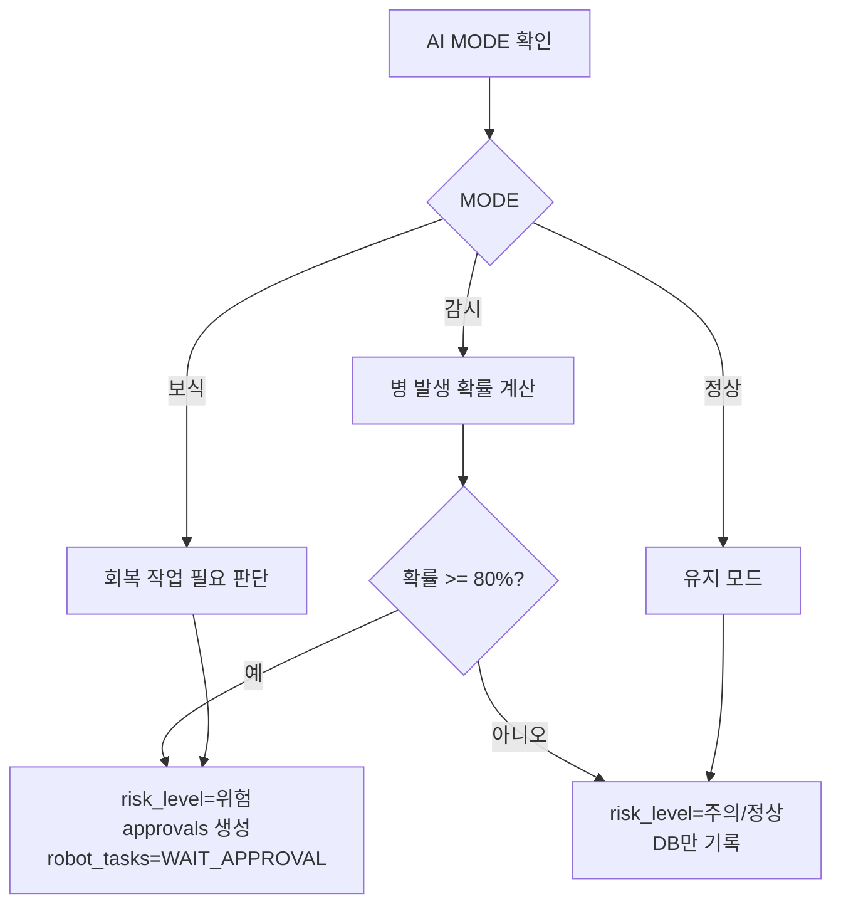
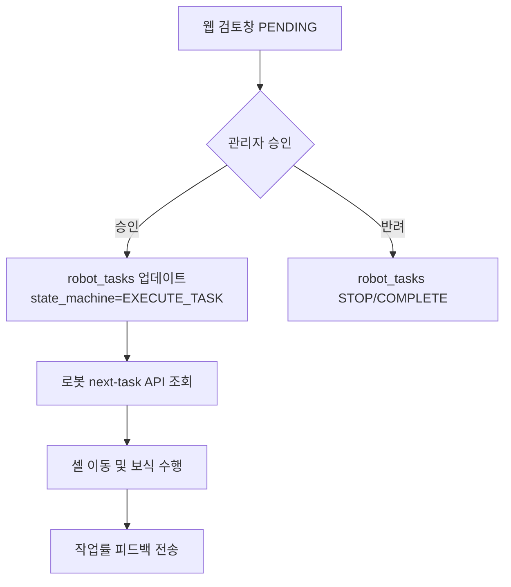
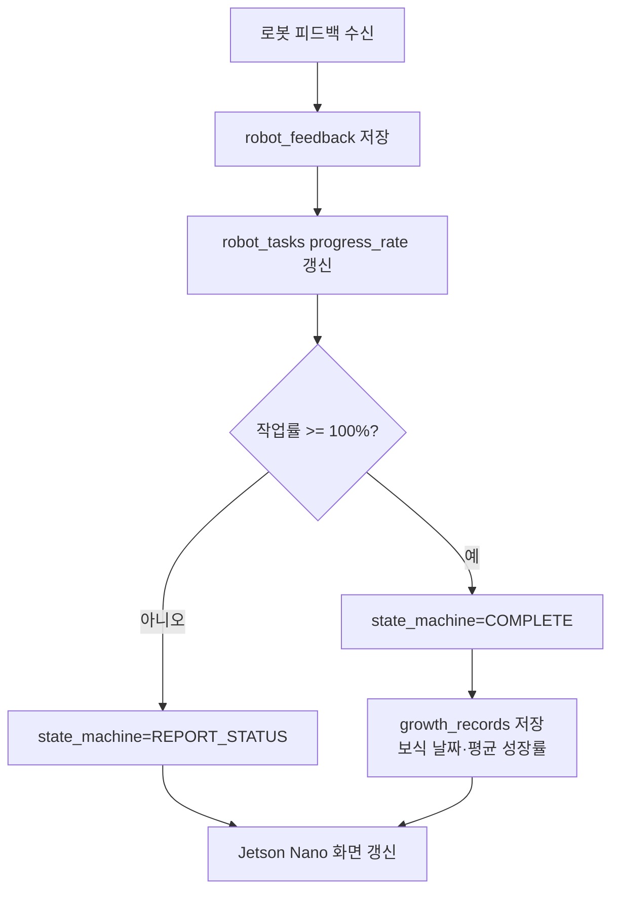
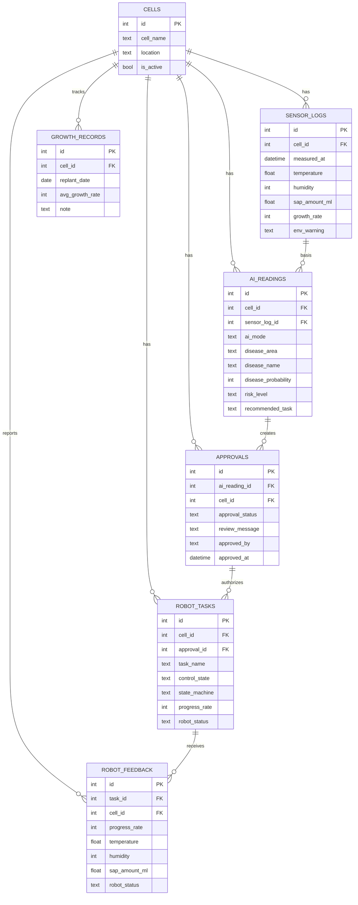

# AI 영농 시스템 플로우차트 및 데이터 관계도

## 1. 전체 시스템 흐름

```mermaid
flowchart TD
    A[센서 입력\n온도·습도·수액량·성장률] --> B[AI 판독\n발병명·발병확률·AI MODE]
    B --> C{발병확률 >= 80%\n또는 환경 기준 이탈?}
    C -- 아니오 --> D[정상 유지 모드\nDB 기록]
    C -- 예 --> E[웹 서버 검토창 표시\n예: 4번 셀 흰곰팡이병 85%]
    E --> F{관리자 승인?}
    F -- 반려 --> G[STOP 또는 유지\n이벤트 기록]
    F -- 승인 --> H[로봇 제어 명령 생성\nID=4, 작업명=보식]
    H --> I[로봇 이동 및 작업 수행\nstate=EXECUTE_TASK]
    I --> J[로봇 상태 피드백\n작업률·환경값·상태]
    J --> K{작업률 100%?}
    K -- 아니오 --> J
    K -- 예 --> L[COMPLETE 업데이트\n평균 성장률·보식 날짜 기록]
```

## 2. 입력 단계 플로우

```mermaid
flowchart LR
    S1[Jetson Nano 센서 수집] --> S2[sensor_logs 저장]
    S2 --> S3{온도 0~40\n습도 0~100\n수액 0~750?}
    S3 -- 정상 --> S4[env_warning=NORMAL]
    S3 -- 이탈 --> S5[env_warning=WARNING]
    S4 --> A1[AI 판독 요청]
    S5 --> A1
    A1 --> A2[ai_readings 저장]
```

## 3. AI 판단 단계 플로우

```mermaid
flowchart TD
    A[AI MODE 확인] --> B{MODE}
    B -- 감시 --> C[병 발생 확률 계산]
    B -- 보식 --> D[회복 작업 필요 판단]
    B -- 정상 --> E[유지 모드]
    C --> F{확률 >= 80%?}
    F -- 예 --> G[risk_level=위험\napprovals 생성\nrobot_tasks=WAIT_APPROVAL]
    F -- 아니오 --> H[risk_level=주의/정상\nDB만 기록]
    D --> G
    E --> H
```

## 4. 웹 승인 및 로봇 제어 플로우

```mermaid
flowchart TD
    W1[웹 검토창 PENDING] --> W2{관리자 승인}
    W2 -- 승인 --> R1[robot_tasks 업데이트\nstate_machine=EXECUTE_TASK]
    W2 -- 반려 --> R2[robot_tasks STOP/COMPLETE]
    R1 --> R3[로봇 next-task API 조회]
    R3 --> R4[셀 이동 및 보식 수행]
    R4 --> R5[작업률 피드백 전송]
```

## 5. 피드백 및 DB 업데이트 플로우

```mermaid
flowchart TD
    F1[로봇 피드백 수신] --> F2[robot_feedback 저장]
    F2 --> F3[robot_tasks progress_rate 갱신]
    F3 --> F4{작업률 >= 100%?}
    F4 -- 아니오 --> F5[state_machine=REPORT_STATUS]
    F4 -- 예 --> F6[state_machine=COMPLETE]
    F6 --> F7[growth_records 저장\n보식 날짜·평균 성장률]
    F5 --> F8[Jetson Nano 화면 갱신]
    F7 --> F8
```

## 6. 데이터 관계도 ERD

```mermaid
erDiagram
    CELLS ||--o{ SENSOR_LOGS : has
    CELLS ||--o{ AI_READINGS : has
    CELLS ||--o{ APPROVALS : has
    CELLS ||--o{ ROBOT_TASKS : has
    CELLS ||--o{ ROBOT_FEEDBACK : reports
    CELLS ||--o{ GROWTH_RECORDS : tracks
    SENSOR_LOGS ||--o{ AI_READINGS : basis
    AI_READINGS ||--o{ APPROVALS : creates
    APPROVALS ||--o{ ROBOT_TASKS : authorizes
    ROBOT_TASKS ||--o{ ROBOT_FEEDBACK : receives

    CELLS {
        int id PK
        text cell_name
        text location
        bool is_active
    }
    SENSOR_LOGS {
        int id PK
        int cell_id FK
        datetime measured_at
        float temperature
        int humidity
        float sap_amount_ml
        int growth_rate
        text env_warning
    }
    AI_READINGS {
        int id PK
        int cell_id FK
        int sensor_log_id FK
        text ai_mode
        text disease_area
        text disease_name
        int disease_probability
        text risk_level
        text recommended_task
    }
    APPROVALS {
        int id PK
        int ai_reading_id FK
        int cell_id FK
        text approval_status
        text review_message
        text approved_by
        datetime approved_at
    }
    ROBOT_TASKS {
        int id PK
        int cell_id FK
        int approval_id FK
        text task_name
        text control_state
        text state_machine
        int progress_rate
        text robot_status
    }
    ROBOT_FEEDBACK {
        int id PK
        int task_id FK
        int cell_id FK
        int progress_rate
        float temperature
        int humidity
        float sap_amount_ml
        text robot_status
    }
    GROWTH_RECORDS {
        int id PK
        int cell_id FK
        date replant_date
        int avg_growth_rate
        text note
    }
```
